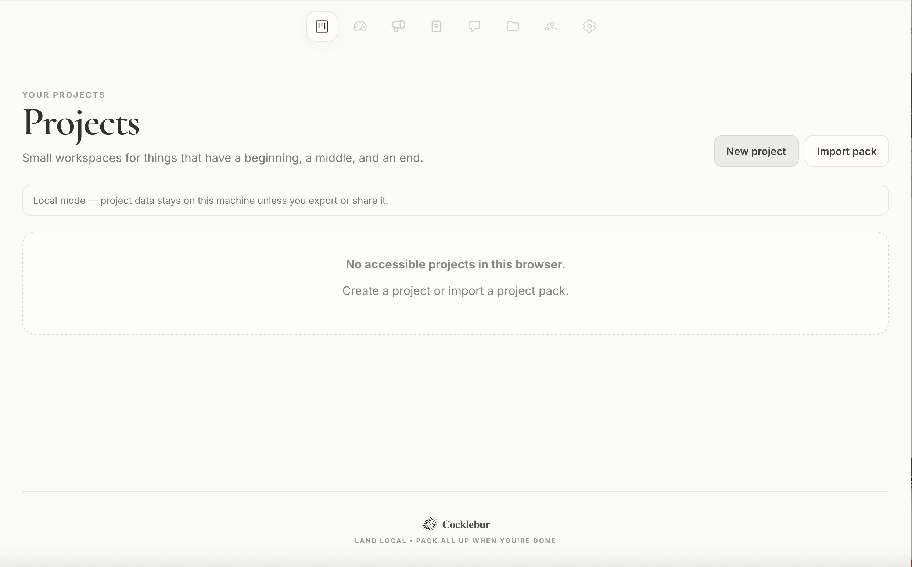
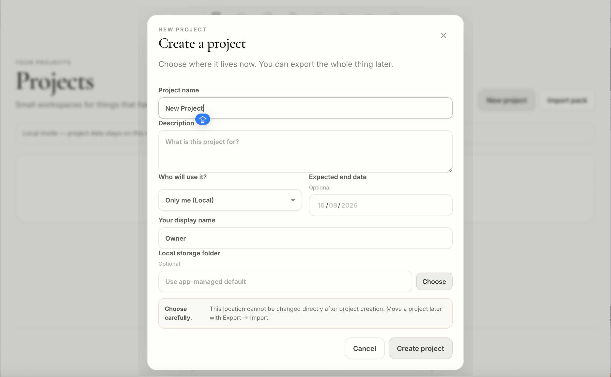

<p align="center">
  
</p>

# Cocklebur

**A lightweight, portable project workspace. Land local. Pack it all up when you're done.**

Cocklebur is a project-first workspace for bounded projects. Use it locally on macOS, or self-host a shared Server edition for a small team. When the project is finished, export the whole workspace as a portable project pack.

**Current release:** `0.2.15`

[繁體中文](README_zh-Hant.md)

## Download

Prebuilt packages are published on the [GitHub Releases](https://github.com/herboratory/cocklebur/releases/latest) page.

- **macOS Desktop** — download the `.dmg`
- **Self-hosted Server** — download the Server `.zip`

This repository is intentionally kept lightweight and serves as the public home for Cocklebur releases, documentation, issue reporting, and project information.

## macOS Desktop

Cocklebur Desktop is local-only and single-user. Project data stays on your Mac unless you explicitly export it.

### First launch on macOS

The current macOS build is **unsigned and not notarized**. macOS may block it on first launch.

1. Try opening Cocklebur once.
2. Open **System Settings → Privacy & Security**.
3. Scroll down and click **Open Anyway** next to Cocklebur.
4. Confirm **Open**.

You normally only need to do this once for that copy of the app.

If macOS reports the app as damaged, first verify that you downloaded it from the official Cocklebur GitHub Release and that its checksum matches. For a known-good copy, advanced users can remove the quarantine attribute:

```bash
xattr -cr /Applications/Cocklebur.app
```

## Self-hosted Server

Cocklebur Server is for small teams that want one canonical shared project workspace.

After downloading and extracting the Server package:

```bash
cp .env.example .env
```

Set at least:

```dotenv
COCKLEBUR_HOST_KEY=replace-with-a-long-random-secret
POPUP_APP_MODE=server
POPUP_DATA_DIR=/data
POPUP_BASE_URL=https://your-cocklebur.example.org
```

Then start it:

```bash
docker compose up -d --build
```

The supplied Docker configuration is intended to sit behind HTTPS through your own reverse proxy or tunnel. Do not expose the app's plain HTTP port directly to the public internet.

## Screenshots

### Projects



### Add New Project



## What Cocklebur includes

- Projects with optional expected end dates
- Dashboard
- Announcements
- To-do and Event Cards
- Checklists, tags and assignees
- Discussion channels and titled threads
- Project files
- Owner / Member / Viewer roles in Server mode
- Invitation and recovery links
- Activity history
- Project export / import
- Human-readable + machine-readable portable project packs

Cocklebur intentionally avoids offline multi-master sync and Google-Docs-style simultaneous co-editing. A project has one canonical active copy.

## Portable by design

A project can be exported as a complete pack containing structured project data, human-readable material, checksums, and original files. The pack can later be imported into Cocklebur again.

## Privacy

Cocklebur is local/self-hosted software. Herboratory does not operate a central Cocklebur project-data service.

Self-hosting still means the administrator of the machine or server can access the underlying files. Application-level visibility controls are not filesystem encryption.

## Support

Cocklebur is a **Herboratory** project.

If Cocklebur is useful to you, you can support the continued development of Herboratory projects on Buy Me a Coffee:

<a href="https://www.buymeacoffee.com/herboratory">
  
</a>

## License

Cocklebur is made available under the **PolyForm Noncommercial License 1.0.0**. Commercial use is not granted.

See [LICENSE](LICENSE).
