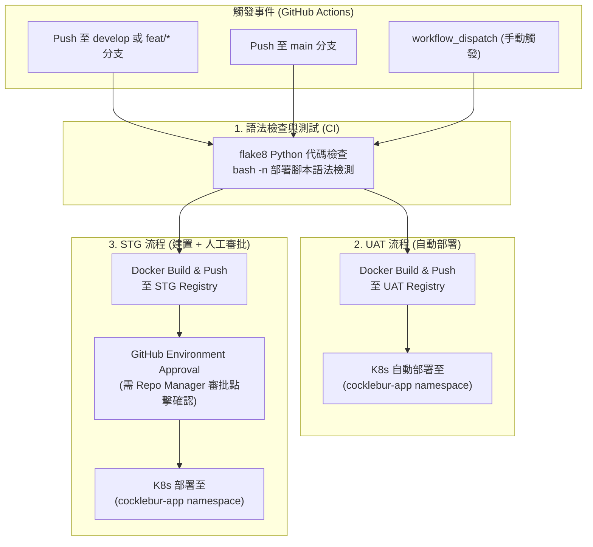

# Cocklebur CI/CD Pipeline 與最小權限配置手冊 (CI/CD Setup & Least-Privilege Guide)

本文件說明如何為 Cocklebur 設定基於 GitHub Actions 的自動化 CI/CD 流程，涵蓋 **UAT 自動部署**、**STG 建置與人工審批手動確認部署**，以及貫徹 **最小權限原則 (Least Privilege Principle)** 的 Kubernetes 與 Docker Registry 憑證配置方式。

---

## 1. CI/CD Pipeline 整體架構設計



---

## 2. 網路連線性與 Runner 選擇

由於企業內部的 Registry（`*.internal`）與 Kubernetes 叢集 API Server 位於私有內部網路（Intranet / RFC1918），GitHub 公有雲的 Public Runner 無法直接解析或連線到私有主機。

### 建議架構：Self-Hosted Runner
在內部網路的一台 Linux 主機（或現有 devops 虛擬機）部署 GitHub Self-Hosted Runner：
1. 進入 GitHub Repository -> **Settings** -> **Actions** -> **Runners** -> **New self-hosted runner**。
2. 依照官方指令在內部主機下載並啟動 runner 代理程序。
3. 在 [.github/workflows/deploy.yml](file:///home/pveUsers/stinger/workspace/cocklebur-server/.github/workflows/deploy.yml) 中已預設指定：
   ```yaml
   runs-on: [self-hosted, linux]
   ```
4. **安全優勢**：Runner 直接運行於內網，映像檔推送到內部 Registry 與執行 `kubectl apply` 速度極快，且不需在防火牆開啟對外公網暴露 API Server。

---

## 3. 貫徹最小權限原則 (Least Privilege Setup)

目前本地開發使用的帳號為具備全域管理員特權（`cluster-admin` 與 root Docker socket），此憑證**嚴禁**直接放置於 CI/CD 系統中。以下為專屬隔離帳號的設定流程：

### 3.1 Kubernetes 最小權限帳號 (RBAC)

已為您建立專屬 RBAC 配置檔 [deploy/k8s/rbac/ci-deployer-rbac.yaml](file:///home/pveUsers/stinger/workspace/cocklebur-server/deploy/k8s/rbac/ci-deployer-rbac.yaml) 與一鍵產生腳本 [deploy/scripts/create-ci-kubeconfig.sh](file:///home/pveUsers/stinger/workspace/cocklebur-server/deploy/scripts/create-ci-kubeconfig.sh)。

#### 權限限制範圍：
* **命名空間隔離**：僅限 `cocklebur-app` 命名空間，跨 Namespace 存取一律被 API Server 回傳 `403 Forbidden`。
* **資源白名單**：僅能操作 Deployment, Service, Ingress, Certificate, ConfigMap, Secret, PVC。
* **禁止敏感行為**：禁止建立/刪除 Namespace、禁止讀取 Node、禁止讀取 cert-manager 或 kube-system 命名空間的密鑰。

#### 一鍵產生 UAT 與 STG 專用 Kubeconfig：
在具備管理權限的終端機執行：
```bash
# 產生 UAT 專用最小權限 Kubeconfig
./deploy/scripts/create-ci-kubeconfig.sh <your-uat-context> uat-ci-kubeconfig.yaml

# 產生 STG 專用最小權限 Kubeconfig
./deploy/scripts/create-ci-kubeconfig.sh <your-stg-context> stg-ci-kubeconfig.yaml
```
完成後，產生的檔案內容即可直接貼至 GitHub Secrets。

---

### 3.2 Docker Registry 最小權限 (Robot Account)

在私有 Container Registry（如 Harbor 或 Docker Registry）：
1. 進入目標專案（如 `team` 或 `cocklebur`）。
2. 建立 **Robot Account**（機器人帳號，例如 `robot$cocklebur-ci`）。
3. **權限勾選最小化**：
   * ✅ **Push Artifact**（允許推圖）
   * ✅ **Pull Artifact**（允許拉圖快取）
   * ❌ *不要勾選* Delete Artifact（禁止刪圖）
   * ❌ *不要勾選* Project Admin（禁止專案管理）
4. 儲存產生的 Token 作為 CI/CD 的帳號與密碼。

---

## 4. GitHub Repository 與 Environment 設定

### 4.1 設定 STG 人工審批保護規則 (Required Reviewers)
1. 進入 GitHub Repository -> **Settings** -> **Environments**。
2. 點擊 **New environment**，名稱輸入 `stg`。
3. 勾選 **Required reviewers**：
   * 加入 Repo Manager 或資深負責人的 GitHub 帳號。
4. 點擊 **Save protection rules**。
5. （選用）同理可建立 `uat` environment 設定部署網址為 `https://cocklebur-uat.example.com`。

> **效果**：當觸發 STG 流程時，映像檔會先自動建置完成，隨後 GitHub Actions 會暫停並發出審批通知。直到審核人員進入介面點擊「Approve and deploy」後，才會執行實體叢集部署！

---

### 4.2 設定 GitHub Secrets 清單
進入 **Settings** -> **Secrets and variables** -> **Actions** -> **Repository secrets**，加入以下項目：

| Secret 名稱 | 範例值 / 說明 |
| :--- | :--- |
| `CI_REGISTRY_ROBOT_USER` | `robot$cocklebur-ci` (Registry 機器人帳號) |
| `CI_REGISTRY_ROBOT_PASSWORD` | Registry 機器人密碼金鑰 |
| `UAT_REGISTRY_HOST` | `registry.example.com/team` (UAT 映像檔倉庫) |
| `UAT_DOMAIN` | `cocklebur-uat.example.com` |
| `UAT_KUBECONFIG` | `uat-ci-kubeconfig.yaml` 之完整文字內容 |
| `STG_REGISTRY_HOST` | `registry.example.com/prod` (STG 映像檔倉庫) |
| `STG_DOMAIN` | `cocklebur-stg.example.com` |
| `STG_KUBECONFIG` | `stg-ci-kubeconfig.yaml` 之完整文字內容 |

---

## 5. 日常使用與觸發操作

1. **UAT 自動部署**：
   * 開發人員只要 `git push` 至 `develop` 分支或 `feat/*` 分支，Pipeline 自動完成檢驗、映像檔建置並發布到 UAT。
2. **STG 部署**：
   * 當程式碼合併至 `main` 時，自動觸發建置推圖至 STG Registry。
   * Repo Manager 在 GitHub PR / Actions 頁面確認變更無誤後，點擊「Review deployments」->「Approve」，系統隨即自動套用至 STG 叢集。
3. **緊急手動部署**：
   * 可進入 GitHub **Actions** -> 選擇 **Cocklebur CI/CD Pipeline** -> **Run workflow**，自選目標環境（uat / stg）與動作（deploy / build-only）。
